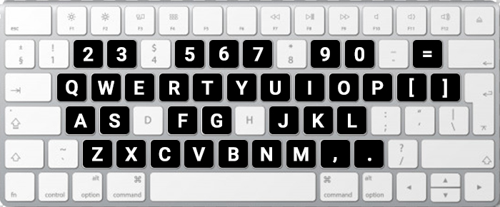

## ➤ Notes

You can see all keys that have a sound in keyboard:
<p align="center">
  
</p>

And also all keywords for write notes:

````
 Left and right hand keys are same. Uppercase 
 letters are control keys. Lowercase letters
 are music notes. Space bar is current duration
 rest. Spaces after first space are ignored.
 Lines start with '#' are ignored.

Control keys:

 Rest:
 RW     - whole rest
 RH     - half rest
 RQ     - quarter rest
 RE     - eighth rest
 RS     - sixteenth rest
 RT     - thirty-second rest
 RI     - sixty-fourth rest

 Durations:
 DW     - whole note
 DH     - half note
 DQ     - quarter note
 DE     - eighth note
 DS     - sixteenth note
 DT     - thirty-second note
 DI     - sixty-fourth note
 DD     - dotted note (adds half duration)

 Octave:
 H0     - octave 0 keys
 HL     - octave 1, 2, 3 (left hand keys)
 HR     - octave 4, 5, 6 (right hand keys)
 H7     - octave 7, 8 keys

 Tempo:
 T#     - where # is 0-9, default is 4

 Sustain:
 SA#    - attack level, where # is 0-9, default is 8
 SD#    - decay level, 0-9, default 4
 SS#    - sustain level, 0-9, default 4
 SR#    - release level, 0-9, default 9

 Voice:
 VD     - Computer generated default voice
 VP     - Piano voice
 VV     - Violin voice (WIP)
 VN     - If a line ends with 'VN', the next line will be played 
          harmony with the line.

 Chord:
 C#     - Play next # notes as a chord, where # is 2-9. 
          For example C major chord is "C3qet"

 Amplitude:
 A#     - Changes current amplitude, where # is 1-9, default is 9

 Measures:
 |      - bar, ignored
 ' '    - space, ignored
 Tab    - tab, ignored

 Comments:
 #      - a line comment
 ##     - start or end of a block comment
````